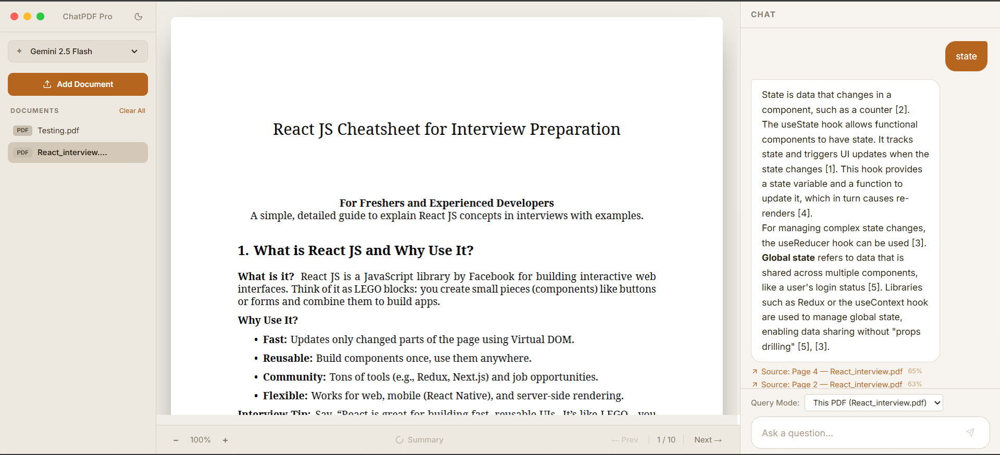
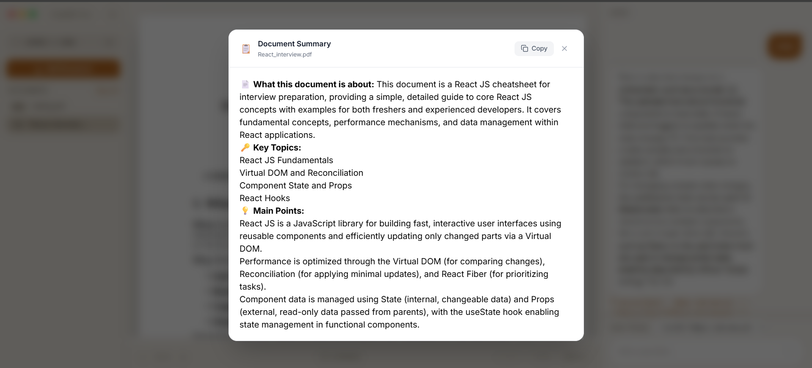

# PDFChat

**Intelligent Document Analysis Through Conversational AI** — Transform static PDFs into interactive knowledge bases with AI-powered retrieval and contextual answers.

---

## 🚀 Overview

PDFChat lets you hold natural language conversations with your PDFs. Instead of manually searching through pages, ask complex questions and get precise answers with source citations you can click through to the exact page.

**Problem Solved**: Traditional PDF readers offer basic text search, but fail at understanding context, relationships between concepts, or answering nuanced questions. PDFChat bridges this gap by retrieving the most relevant passages and letting a frontier model reason over them.

**Real-World Impact**: Ideal for researchers analyzing academic papers, professionals reviewing contracts, students studying textbooks, or anyone who needs to extract insights from dense documentation quickly.

---

## ✨ Key Features

- **📊 Page-aware chunking**: Splits each page into 1000-character chunks with 100-character overlap, keeping the page number and character offsets of every chunk
- **🔀 Hybrid retrieval**: Combines cosine similarity over local hash embeddings (40%) with weighted keyword matching (60%) to rank relevant chunks
- **💬 Streaming AI answers**: Real-time token streaming over Server-Sent Events, powered by Google Gemini with automatic retry on 429/503 and network failures
- **📍 Precision citations**: Only chunks the model actually cited (`[1]`, `[2]`, …) are returned, each with page number, matched sentence, and a confidence score
- **🧠 Click-to-source**: Clicking a citation opens the source PDF at the cited page with the matching text highlighted
- **📄 AI document summaries**: One-click structured summary generated per document, shown in a modal on upload
- **💡 Suggested follow-ups**: Up to 3 AI-generated next questions, each validated against the document so you never get a dead-end suggestion
- **🎯 Single or all documents**: Scope a question to the selected PDF or query across your whole library
- **🔧 Model flexibility**: Switch between Gemini 2.5 Flash (fast) and 2.5 Pro (deeper) at any time
- **📱 Adaptive UI**: Light/dark themes, sidebar drawer on tablet, tab-based Docs / PDF / Chat navigation on mobile
- **🗂️ Library management**: Upload, delete individual documents, or clear the whole library (files and chunks together)
- **💾 Persistent chats**: Messages stored in SQLite and reloaded on refresh

---

## 🧠 System Architecture

### High-Level Overview

A single Node process serves both the API and the React SPA. Vite runs in middleware mode, so development and "start" behave the same way — there is no separate frontend server to launch.

### Architecture Diagram

```
┌─────────────────┐    ┌──────────────────────┐    ┌─────────────────┐
│   React UI      │    │   Express API        │    │   Gemini API    │
│   (Vite SPA)    │◄──►│   (same Node process)│◄──►│   (text only)   │
│                 │    │                      │    │                 │
│ - PDF Viewer    │    │ - /api/upload        │    │ - Chat stream   │
│ - Chat + SSE    │    │ - /api/chat (SSE)    │    │ - Summaries     │
│ - Upload Zone   │    │ - /api/documents/*   │    │ - Suggestions   │
│ - Summary modal │    │ - /api/chats/*       │    │                 │
└─────────────────┘    └──────────┬───────────┘    └─────────────────┘
                                  │
                     ┌────────────────────────────┐
                     │   Local (no external DB)  │
                     │                            │
                     │ - better-sqlite3          │
                     │   documents / chunks /    │
                     │   chats / messages        │
                     │ - uploads/ (PDF files)    │
                     │ - local hash embedding    │
                     │   + hybrid scoring        │
                     └────────────────────────────┘
```

### Component Breakdown

#### Frontend (`src/`)

- **React 19 + TypeScript + Vite** — component architecture with hooks, no global state library
- **PDF rendering** — `react-pdf` renders the uploaded file and highlights the cited sentence
- **Chat interface** — reads the SSE stream with a `ReadableStream` reader, renders answers as Markdown (`react-markdown`)
- **Layout** — three breakpoints: fixed sidebar + split view (desktop), drawer + split view (tablet), bottom-tab single panel (mobile)
- **Theming** — token maps for light/dark applied with `clsx`, plus `data-theme` and `color-scheme` on `<html>`

#### Backend (`server.ts`, `src/server/`)

- **API server** — Express with JSON + CORS, Multer uploads, and SSE streaming for chat
- **Ingestion** (`ingestion.ts`) — PDF.js text extraction per page, 1000/100 chunking, embedding generation, batch insert
- **Retrieval** (`vector.ts`) — scans stored chunks, scores with hybrid similarity, applies a relevance gate, returns top-K
- **Chat orchestration** (`chat.ts`) — prompt assembly, Gemini streaming with retry, citation parsing, source payloads
- **Prompts** (`prompts.json`) — system instruction, summary format, and suggestion prompt kept out of the code
- **Persistence** (`db.ts`) — `better-sqlite3`, synchronous prepared statements, tables auto-created on boot

### Data Flow Architecture

#### Document Ingestion

```
PDF Upload → PDF.js text extraction (per page) → Chunking (1000 chars, 100 overlap)
           → Hash embedding (768-dim) → SQLite insert (content, page, offsets, vector)
```

Embeddings are computed **locally** — no embedding API is called during ingestion.

#### Query Processing

```
User query → Local hash embedding → Hybrid scoring (0.4·cosine + 0.6·keyword)
           → Relevance gate → Top 5 chunks → Numbered context [1]…[5] in system instruction
           → Gemini stream → SSE text frames → final sources frame
```

#### Response Delivery

```
Token frames ──────────────► streaming Markdown render
Sources frame (post-stream) ► citation chips with confidence %
                            ► click → PDF panel jumps to page + highlights sentence
```

### Key Design Decisions

- **Hybrid retrieval weighting** — keyword score is weighted 60% because the hash embedding captures character patterns, not semantics; keyword matching carries most of the retrieval signal
- **Relevance gate** — a chunk must produce at least one keyword match and exceed a hybrid score of `0.15`, so weak matches never reach the model
- **Positional keyword weighting** — earlier query words weigh more (`1/(i+1)`), so the first terms in a question dominate matching
- **Citation parsing** — the model is asked to cite `[n]`; only those chunks are returned as sources, with the sentence best matching the question used as the preview
- **Chunking** — 1000 characters with 100 characters of overlap, per page, retaining character offsets for locating text in the viewer
- **Bounded concurrency** — chunks are embedded and inserted in batches of 5
- **No external services** — storage, retrieval, and embeddings are all local, so the only network dependency is the Gemini API
- **Retry policy** — 3 attempts with 3s/6s backoff for 429/503 and network-level errors; failures are surfaced to the UI as an SSE `error` frame

---

## ⚙️ Tech Stack

### Frontend

- **React 19** — component architecture with hooks
- **TypeScript** — type-safe components and API layer
- **Vite 6** — dev server in middleware mode + production bundler
- **Tailwind CSS 4** — utility styling via `@tailwindcss/vite` (no `tailwind.config.js`)
- **react-pdf** — client-side PDF rendering
- **react-markdown** — Markdown rendering for streamed answers
- **lucide-react** — icons
- **clsx** — conditional class composition

### Backend

- **Node.js** (20.x / 22.x+) with **tsx** for TypeScript execution
- **Express 4** — REST API + SSE
- **better-sqlite3** — embedded database (`database.sqlite`)
- **multer** — multipart PDF uploads to `uploads/`
- **pdfjs-dist** (legacy build) — server-side text extraction
- **@google/genai** — Gemini SDK for chat, summaries, and suggestions
- **uuid** — document/chunk/message IDs

### AI & Data

- **Google Gemini API** — `gemini-2.5-flash` (default) and `gemini-2.5-pro`
- **Local hash embedding** — 768-dimension character-hash vectors, normalized (no external embedding provider)
- **SQLite vector store** — embeddings stored as JSON in the `chunks` table and scored at query time

---

## 📸 Screenshots

Upload and chat:



AI document summary:



---

## 🛠️ Installation & Setup

### Prerequisites

- **Node.js ≥ 20** (20.19+ or 22.12+ recommended — required by `better-sqlite3` and `@vitejs/plugin-react`)
- **npm**
- **Google Gemini API key** — free tier at [Google AI Studio](https://aistudio.google.com/app/apikey)

### Quick Start

1. **Clone and navigate**

   ```bash
   git clone <repository-url>
   cd PDFChat
   ```

2. **Install dependencies**

   ```bash
   npm install
   ```

3. **Configure environment**

   ```bash
   cp .env.example .env      # macOS / Linux
   copy .env.example .env    # Windows PowerShell / CMD
   ```

   Then edit `.env`:

   ```env
   GEMINI_API_KEY=your_api_key_here
   # Optional: DISABLE_HMR=true to turn off Vite HMR
   ```

4. **Start the server**

   ```bash
   npm run dev
   ```

5. **Open the app**

   Visit [http://localhost:3000](http://localhost:3000), upload a PDF, and start asking questions.

### npm Scripts

| Script | Command | Notes |
| --- | --- | --- |
| `npm run dev` | `tsx server.ts` | Express API + Vite middleware, HMR enabled |
| `npm run build` | `vite build` | Bundles the SPA into `dist/` |
| `npm run lint` | `tsc --noEmit` | Type check only — no ESLint config in this repo |
| `npm start` | `tsx server.ts` | Identical to `npm run dev`; Vite middleware is always used |
| `npm run clean` | `rm -rf dist` | POSIX only |

> **Note**: `npm start` currently boots the app in development mode (Vite in middleware mode) and does not serve the built `dist/` output. For a true production deploy, serve `dist/` from a static host or add a static-file branch to `server.ts` before running `npm run build && npm start`.

### Runtime Artifacts

These are created on first run and are git-ignored:

- `database.sqlite` — documents, chunks, embeddings, chats, messages
- `uploads/` — uploaded PDFs under generated UUID filenames

---

## 📌 Usage

### Basic Workflow

1. **Upload** — drag & drop or select a PDF (PDF only). A summary is generated automatically and shown on completion.
2. **Scope** — pick a document in the sidebar to query it alone, or use "All documents" to search across the library.
3. **Ask** — type a question, or click one of the suggested follow-ups.
4. **Verify** — read the answer and its citations; each chip shows a confidence score and the matched sentence.
5. **Navigate** — click a citation to jump to that page in the PDF panel with the text highlighted.

### Query Examples

- **Summarization** — "Summarize the key arguments against the proposed solution"
- **Cross-reference** — "Compare the approaches in chapters 3 and 5"
- **Locate evidence** — "What evidence supports the hypothesis on page 12?"
- **Cross-document** — in "All documents" mode: "Which documents mention the same methodology?"

### Model Selection

- **Gemini 2.5 Flash** (default) — fast, used for chat, summaries, and suggestions
- **Gemini 2.5 Pro** — slower, deeper reasoning for complex or technical questions

### API Reference

| Method | Endpoint | Description |
| --- | --- | --- |
| `POST` | `/api/upload` | Multipart `file` upload; ingests and indexes the PDF |
| `GET` | `/api/documents` | List indexed documents |
| `GET` | `/api/documents/:id/content` | Stream the stored PDF |
| `DELETE` | `/api/documents/:id` | Delete a document, its chunks, and its file |
| `DELETE` | `/api/documents` | Delete all documents and uploaded files |
| `POST` | `/api/chats` | Create a chat session |
| `GET` | `/api/chats/:chatId` | Fetch message history for a chat |
| `PATCH` | `/api/chats/:id/title` | Rename a chat |
| `POST` | `/api/chat` | `{ message, chatId, mode, pdf_id?, model? }` → SSE stream of `text` frames then a `sources` frame |
| `POST` | `/api/documents/:id/summary` | Generate a document summary |
| `POST` | `/api/documents/:id/suggestions` | Generate validated follow-up questions |

### Project Structure

```
.
├── server.ts              # Express app, routes, Vite middleware
├── src/
│   ├── App.tsx            # Layout, theming, document/chat state
│   ├── components/        # ChatInterface, PDFViewer, UploadZone, SummaryModal
│   ├── hooks/useChat.ts   # SSE consumption, message state, suggestions
│   ├── lib/api.ts         # Typed fetch wrappers
│   └── server/            # db.ts, ingestion.ts, vector.ts, chat.ts, prompts.json
├── database.sqlite        # Generated
├── uploads/               # Generated
└── .env.example
```

---

## 🚧 Challenges & Learnings

**PDF text extraction**: Text layer quality varies widely across PDFs (scans, broken encodings, multi-column layouts). The extractor joins PDF.js text items with spaces, which is reliable for born-digital documents but degrades on scanned ones — OCR would be the next step.

**Retrieval without a real embedding model**: The local 768-dim character-hash vector captures surface character patterns, not meaning. It is fast and dependency-free, but it cannot match synonyms or paraphrase, which is exactly why keyword matching is weighted more heavily in the hybrid score.

**Relevance gating matters**: Returning the top-5 chunks unconditionally injected unrelated context into prompts. Requiring a keyword hit and a minimum hybrid score measurably reduced off-topic answers.

**Citation integrity**: Trusting retrieved chunks as "sources" produced false attributions. Parsing `[n]` markers out of the model's own response and returning only those chunks keeps citations honest.

**Streaming resilience**: Transient 503/429 responses and dropped connections are common with the Gemini API. Retrying with backoff and forwarding errors as an SSE `error` frame keeps the UI responsive instead of hanging on a spinner.

**Full-scan retrieval**: Chunks are loaded and scored on every query, which is fine for a personal library but does not scale — an approximate nearest-neighbour index would be required for large collections.

---

## 🔮 Future Improvements

**Real embeddings**: Swap the local hash embedding for a hosted embedding model (Gemini, Vertex AI, or a local sentence-transformer) to capture semantic similarity.

**ANN vector index**: Move from full-table scans to an approximate nearest-neighbour index (e.g. sqlite-vec or a dedicated vector DB) for large libraries.

**Multi-modal ingestion**: Extract and describe images, charts, and tables via vision-language models.

**Richer context assembly**: Hierarchical chunking, query expansion, and multi-stage retrieval for long documents.

**Conversation memory**: Feed prior turns into the prompt and let follow-up questions resolve pronouns and references against earlier context.

**Collaborative features**: Multi-user sessions, shared document workspaces, and annotations.

**Security & hardening**: Auth, per-document access control, upload size/type validation, rate limiting, and audit logging.

---

## 👨‍💻 Author

Full-stack developer focused on AI-powered applications and developer experience.

_Built to demonstrate a practical retrieval-augmented generation pipeline: ingestion, hybrid retrieval, grounded generation, and verifiable citations._
